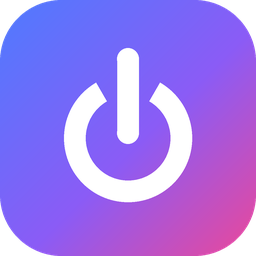

<p align="center"></p>

# Stowaway for Home Assistant

[](https://github.com/Sat32blk/Stowaway-homeassistant/actions/workflows/validate.yml)
[](https://hacs.xyz)
[](https://buymeacoffee.com/sat32blk)

See and control the apps that [Stowaway](https://github.com/Sat32blk/Stowaway) puts to sleep and wakes on demand, and the containers it restarts on a schedule.

## What you get

Each app gets the same things you see for it in Stowaway's app list.

For each app Stowaway puts to sleep:

| Entity | What it does |
|---|---|
| `switch.<app>_awake` | On while the app is awake. Turn off to put it to sleep now, on to wake it. |
| `select.<app>_keep_awake` | Off, 30 minutes, 1, 2, 4, 8 or 24 hours, or Until released. Picking a time wakes the app if it's asleep; Off lets it sleep when idle again. |
| `sensor.<app>_status` | Awake, Asleep, Starting, Going to sleep, Updating, Maintenance or Failed to start. The `label` attribute is the dashboard label, e.g. *Sleeping in 8 min*. |
| `sensor.<app>_sleep_mode` | How it's put to sleep, e.g. *Sleeps after 15 min* or *Sleeps only when told*. Attributes: awake while busy, awake hours, kept awake until, won't wake when opened, restart schedule. |
| `sensor.<app>_cpu` | CPU use in % (0 while asleep). |
| `sensor.<app>_memory` | Memory use in MB (0 while asleep). |
| `sensor.<app>_last_woken_by` | What last opened or woke it: a device on your network, Home Assistant, an API token, its awake hours, or Stowaway's Wake / Keep awake. Attributes include when, the device and its IP address. |
| `binary_sensor.<app>_update_ready` | A newer version was found; it installs the next time the app wakes. |

Containers that Stowaway only restarts on a schedule get the status, sleep mode (*Not managed · restarts …*), CPU and memory sensors.

Stowaway itself gets `sensor.stowaway_apps_asleep` and `sensor.stowaway_memory_freed`.

**Apps added to or removed from Stowaway** show up in Home Assistant (or disappear from it) within 15 seconds, with no need to remove and re-add the integration. If an app was removed while Home Assistant was off, it's tidied up on the next start; you can also delete a leftover app device yourself from its device page.

Actions (on an app's `awake` switch):
- `stowaway.keep_awake` with `minutes`, or `forever: true`
- `stowaway.release` ends a keep-awake
- `stowaway.sleep` with `block: true` to also stop visitors from waking it
- `stowaway.allow_wake` lets visitors wake it again, without waking it now

### Upgrading from 1.0

Version 1.1 changes the entities to match Stowaway's app list. These were removed: the *Don't wake* switch, the *Restart now* and *Keep awake 1 hour* buttons, and the *Sleeps at*, *Next restart* and *Maintenance running* sensors. Automations or dashboard cards using them need updating:

| Was | Now |
|---|---|
| `switch.<app>_don_t_wake` on | `stowaway.sleep` with `block: true` |
| `switch.<app>_don_t_wake` off | `stowaway.allow_wake` (or turn the awake switch on, which also allows waking) |
| `button.<app>_keep_awake_1_hour` | `select.<app>_keep_awake` → 1 hour |
| `button.<app>_restart_now` | Turn the awake switch off and on, or use Stowaway's own page |
| `sensor.<app>_next_restart` | `restart_schedule` attribute of `sensor.<app>_sleep_mode` |

The sleep mode and last woken by sensors need Stowaway 1.6.3 or newer; with older Stowaway the sleep mode is worked out from the idle time and last woken by stays unknown.

## Install

1. In HACS: **⋮ → Custom repositories**, add `https://github.com/Sat32blk/Stowaway-homeassistant` as an **Integration**, then install **Stowaway** and restart Home Assistant.
   Without HACS, copy `custom_components/stowaway` into your Home Assistant `config/custom_components/` folder.
2. In the Stowaway dashboard: **System Settings → Home Assistant → Create token** (Stowaway 1.6+; older versions: **Integrations → Home Assistant**). Copy it.
3. In Home Assistant: **Settings → Devices & services → Add integration → Stowaway**. Enter Stowaway's address (e.g. `192.168.1.2:8880`) and the token.

Home Assistant must be on your home network, unless you allowed the Stowaway dashboard from outside. If the token is revoked, Home Assistant asks for a new one.

Needs Stowaway 1.0.0 or newer and Home Assistant 2025.1 or newer.

## Examples

**Switch media servers off while nobody's home, back on when someone arrives**

```yaml
automation:
  - alias: Media servers off while away
    triggers:
      - trigger: numeric_state
        entity_id: zone.home
        below: 1
        for: "00:15:00"
    actions:
      - action: stowaway.sleep
        target:
          entity_id: [switch.plex_awake, switch.jellyfin_awake]
        data:
          block: true          # leave this out to let remote streaming still wake them

  - alias: Media servers back when home
    triggers:
      - trigger: numeric_state
        entity_id: zone.home
        above: 0
    actions:
      - action: stowaway.allow_wake
        target:
          entity_id: [switch.plex_awake, switch.jellyfin_awake]
      - action: switch.turn_on          # optional: have Plex ready before you sit down
        target:
          entity_id: switch.plex_awake
```

**Keep Jellyfin awake during movie night**

```yaml
- action: select.select_option
  target:
    entity_id: select.jellyfin_keep_awake
  data:
    option: 4_hours
```

## Development

```bash
pip install pytest-homeassistant-custom-component
pytest
```

## Support

If Stowaway saves you some resources (or some hassle), you can buy me a coffee. Thank you!

<a href="https://buymeacoffee.com/sat32blk"></a>

## License

MIT. See [LICENSE](LICENSE).
